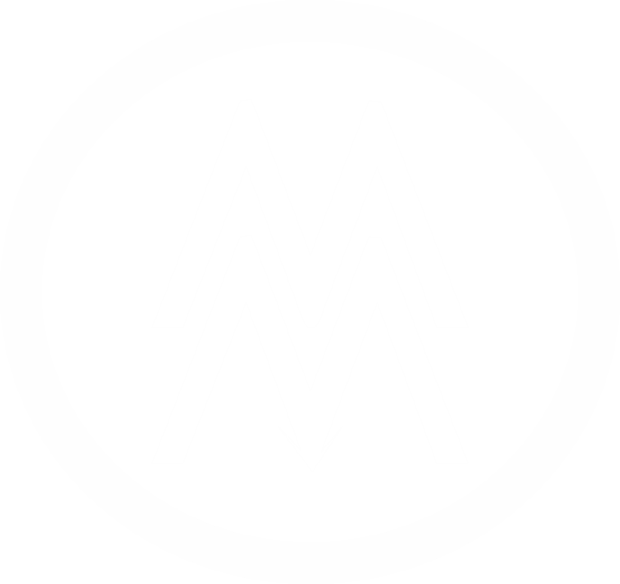

# GWL Post Studio

> **A professional social media post editor for companies and creators worldwide.**
> Built and designed by **Ikuyinminu Michael Mazzideno** | @mazzigroup



---

## What Is This?

GWL Post Studio is a **browser-based visual post editor** that lets any company or content creator design, edit, and export high-quality social media post images (1080×1080 or 1080×1920 Story format) directly in their browser — no Canva subscription, no Photoshop, no design skill required.

Originally built for **Goodwill Language Solution** (GWL), this tool is designed to be adapted for any brand, business, or creator around the world.

---

## Live Features

| Feature | Description |
|---|---|
| 🎨 8 Post Templates | Reality Check, Bold Quote, Myth vs Truth, Fact, Culture Drop, Announce, Promo, Blank |
| ✏️ Full Text Editing | Headline, body, label, CTA, brand line — all editable live |
| 🔤 Text Transform | UPPERCASE / lowercase / Title Case per field |
| 📐 Alignment | Left / Center / Right for all post text |
| 🖋️ Font Picker | Playfair Display, Space Grotesk, Plus Jakarta Sans |
| 🎨 Accent Colors | 8 swatches + custom color picker |
| 🌈 Background Styles | Gradient, Solid, Geometric, Radial Glow, Diagonal Split |
| 🔷 Shape Elements | Rectangle, Circle, Triangle, Line, Star, Quote Mark — drag to reposition |
| 🖼️ Logo Upload | Drop your own PNG logo with position and size control |
| 🌙 Dark / Light Mode | Full theme switch at the top |
| 📤 Export | PNG (lossless), JPG (compressed), Story format (1080×1920) |
| 📋 Copy Caption | One-click copy of full post text for pasting into Facebook, Instagram, etc. |

---

## How To Use

### Option A — Run locally (no install)

1. Clone or download this repo:
   ```bash
   git clone https://github.com/mazzigroup/gwl-post-studio.git
   cd gwl-post-studio
   ```

2. Open `index.html` directly in your browser (Chrome or Edge recommended).

3. Start editing and download your post.

### Option B — Host it (Netlify, GitHub Pages, Vercel)

**GitHub Pages:**
1. Push this repo to GitHub
2. Go to Settings → Pages
3. Set source to `main` branch, root folder
4. Your editor is live at `https://yourusername.github.io/gwl-post-studio`

**Netlify (recommended for best performance):**
1. Go to [netlify.com](https://netlify.com) and sign up
2. Click "Add new site" → "Deploy manually"
3. Drag and drop your project folder
4. It's live instantly with a shareable URL

**Vercel:**
```bash
npm install -g vercel
vercel
```

---

## How To Customize For Your Company

All you need to edit is a few values:

### 1. Change the brand name
Open `index.html` and find:
```html
<input type="text" id="inBrand" value="GOODWILL LANGUAGE SOLUTION  ·  CLARITY. ACROSS BORDERS.">
```
Replace with your own brand name and tagline.

### 2. Change the templates
Open `editor.js` and find the `templates` object near the top. Edit or add new template entries:
```javascript
const templates = {
  mytemplate: {
    label: 'MY COMPANY',
    headline: 'Your headline here.',
    accent: 'highlighted phrase',
    body: 'Your body text here.',
    cta: 'Your call to action',
    brand: 'MY BRAND  ·  MY TAGLINE'
  }
};
```
Then add a button in `index.html`:
```html
<button class="tpl-btn" onclick="setTpl('mytemplate',this)">My Template</button>
```

### 3. Change the logo
Replace `assets/mazzigroup-logo.png` with your own logo PNG.

### 4. Change default colors
Open `editor.js` and change:
```javascript
let accentColor = '#FFCA28'; // Your brand accent
```
And in `index.html`:
```html
<input type="color" id="bgTop" value="#0B2D6E">  <!-- Your brand dark color -->
<input type="color" id="bgBot" value="#1A5DC8">  <!-- Your brand light color -->
```

---

## Advanced Roadmap (How To Grow This Tool For Global Companies)

Want to take this to the next level? Here are recommended development phases:

### Phase 1 — Multi-Brand Workspace
- Brand profile system (save your colors, fonts, templates per brand)
- LocalStorage or Firebase backend for saving designs
- User accounts with login

### Phase 2 — Asset Library
- Upload and reuse logos, photos, icons
- Background image/photo support with overlay
- Built-in stock photo search (Unsplash API)

### Phase 3 — Team Collaboration
- Share designs via link
- Comments and approval workflow
- Role-based access (editor, approver, viewer)

### Phase 4 — AI Integration
- Auto-generate headline and body from a topic using Claude API
- Auto-color palette from uploaded brand logo
- Caption translation for multilingual posts

### Phase 5 — Platform Publishing
- Direct post to Facebook Page, Instagram, Twitter/X
- Schedule posts (Meta API, Buffer API)
- Post performance analytics dashboard

### Phase 6 — White-Label SaaS
- Resell the platform to agencies and companies
- Custom domain per client
- Subscription billing (Stripe integration)

---

## Tech Stack

| Layer | Technology |
|---|---|
| Frontend | Vanilla HTML, CSS, JavaScript (no framework — runs anywhere) |
| Canvas Rendering | HTML5 Canvas API |
| Fonts | Google Fonts (Playfair Display, Plus Jakarta Sans, Space Grotesk) |
| Icons | Tabler Icons |
| Export | Canvas `toDataURL()` — PNG and JPG |
| Hosting | Any static host (GitHub Pages, Netlify, Vercel) |

No build step. No npm install. No dependencies. Just open and run.

---

## File Structure

```
gwl-post-studio/
├── index.html        ← Main editor UI
├── style.css         ← All styles (dark + light mode)
├── editor.js         ← All canvas logic and interactions
├── assets/
│   └── mazzigroup-logo.png
└── README.md         ← This file
```

---

## License

MIT License — free to use, modify, and distribute for personal and commercial projects.
If you build something cool with it, credit @mazzigroup. 🙏

---

## Contact / Developer

**Ikuyinminu Michael Mazzideno**
- 📱 Phone: [08122985651](tel:+2348122985651)
- 🐦 GitHub / Social: [@mazzigroup](https://github.com/mazzigroup)
- 📍 Akure, Ondo State, Nigeria
- © @mazzigroup 2026

---

*"Built to give every company a voice — across borders, across languages, across screens."*
